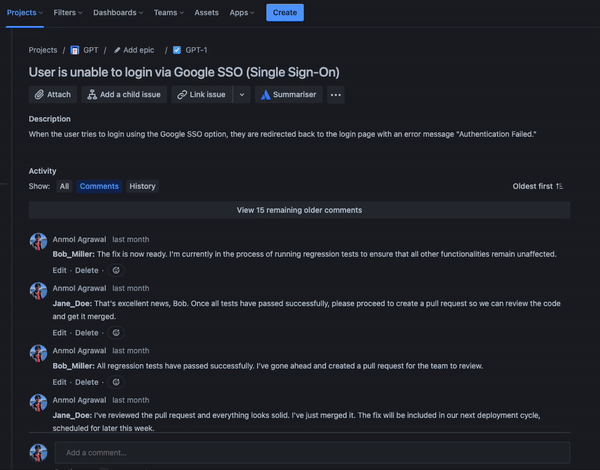

# Jira comment summariser app with Forge and OpenAI

When a user goes through lots of comments in a Jira issue, it can be overwhelming and time-consuming. It may become difficult to keep track of important details or decisions made during the discussion. Additionally, as more comments are added, it becomes harder to find the relevant information needed to take action on the issue at hand. 

This is a Forge app that integrates with OpenAI APIs to summarise comments in Jira issues to address the above challenges.

# Prerequisites
Before we get started, make sure you have the following:

- A Jira Cloud instance where you can install and test your app

- Basic knowledge of JavaScript, React and [Forge platform](https://developer.atlassian.com/platform/forge/getting-started/).

- Completed [Build a Jira hello world app](https://developer.atlassian.com/platform/forge/build-a-hello-world-app-in-jira/).

- An OpenAI API key which you can obtain from [OpenAI website](https://platform.openai.com/docs/api-reference/introduction)

# Demo




## Quick start

Here are the steps to try out this app in your Jira Cloud instance:

- Download this repo:

```
git clone https://github.com/anmolagrwl/forge-ai-jira-comment-summariser.git
```

- In your command terminal, enter the directory of the cloned repo:
```
cd forge-ai-jira-comment-summariser
```

- Install required npm packages by running:
```
npm install
```

- [Register your app](https://developer.atlassian.com/platform/forge/cli-reference/register/#description). This will create a new unique app ID for your copy of this app. :
```
forge register
```

- Set OpenAI API key as environment variable. An OpenAI API key which you can obtain from [OpenAI website](https://platform.openai.com/docs/api-reference/introduction). You can find your Secret API key in your [User settings](https://platform.openai.com/account/api-keys). Please make sure you have enough [credit balance](https://platform.openai.com/account/billing/overview) to make these OpenAI API calls.:
```
forge variables set --encrypt OPEN_API_KEY your-key
```

- Build and deploy your app by running:
```
forge deploy
```

- Install your app in an Atlassian site by running:
```
forge install
```
&nbsp; &nbsp; &nbsp; Select 'Jira' as Atlassian product using the arrow keys and press the enter key.

&nbsp; &nbsp; &nbsp; Enter the URL for your development site. For example, example.atlassian.net.

- Once the app is installed, you can go ahead in your Jira instance mentioned before and try out the app in your sample issue as shown in demo.

### Notes

- Tutorial COMING SOON
- The OpenAI API integration requires developers to use appropriate endpoints and methods, maintain security best practices, and consider potential biases and limitations. Ethical considerations are important to avoid unintended consequences.

## Support

See [Get help](https://developer.atlassian.com/platform/forge/get-help/) for how to get help and provide feedback.
If you require any additional help, please don't hesitate to reach out to our [developer community](https://community.developer.atlassian.com/).
